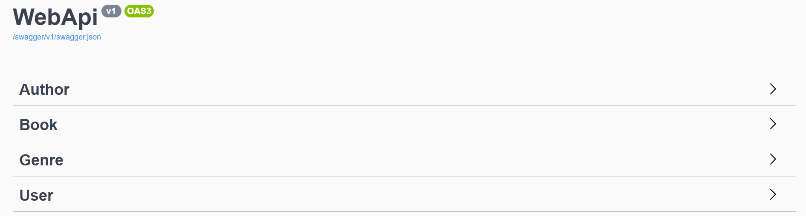

# Bookstore Projesi

## Proje Hakkında

Bookstore, .NET 5 teknolojisi kullanılarak geliştirilmiş, RESTful API prensiplerine uygun bir kitap yönetim sistemidir. Projede; kitapların CRUD işlemleri, yazar ve tür yönetimi, kullanıcı doğrulama, yetkilendirme ve test odaklı geliştirme gibi modern backend geliştirme teknikleri uygulanmıştır.

## Kullanılan Teknolojiler

- .NET 5  
- Entity Framework Core (ORM)  
- RESTful Web API  
- Fluent Validation (Model doğrulama)  
- Dependency Injection (Bağımlılık yönetimi)  
- Swagger & Postman (API test ve dökümantasyon)  
- JWT Token Bazlı Kimlik Doğrulama  
- TDD (Test Driven Development) yaklaşımı  

## İçerik ve Özellikler

### Temel API Özellikleri

- Kitaplar için GET, POST, PUT, DELETE endpointleri  
- Yazarlar ve türler için controller ve servisler  
- Okunabilir ve standartlara uygun API tasarımı (Route, Action Methodlar)  
- Swagger ve Postman ile API test edilebilirliği  

## Veri Yönetimi

- Projede gerçek bir veritabanı yerine, geliştirme ve test aşamalarında kolaylık sağlayan **InMemoryDatabase** kullanılmıştır.  
- Bu sayede veriler uygulama çalıştığı sürece bellekte tutulur, kalıcı veri depolaması yapılmaz.  
- Entity Framework Core'un InMemory provider'ı ile hızlı CRUD işlemleri gerçekleştirilir.  
- Bu yöntem özellikle geliştirme, test ve prototip aşamasında tercih edilir.  
- İlerleyen aşamalarda isterseniz, gerçek MSSQL veya başka ilişkisel veritabanı ile kolayca değiştirilebilir.  

## Geliştirme Pratikleri

- Middleware kullanımı (Özel hata yönetimi)  
- Dependency Injection ile servis yönetimi  
- Test Driven Development ile güvenilir kod (Örnek testler mevcut)  
- Token bazlı kimlik doğrulama ve refresh token mekanizması

## API Yapısı (Swagger)



## Kurulum

1. Bu repoyu klonlayın:  
   ```bash
   git clone https://github.com/MuhammedMustafaDemirhan/BookStore.git
2. Visual Studio Code veya Visual Studio 2019/2022 ile açın.
3. .NET 5 SDK'nın sisteminizde yüklü olduğundan emin olun.
4. Projede gerekli NuGet paketlerini restore edin:
   ```bash
   dotnet restore
5. Uygulamayı çalıştırın:
   ```bash
   dotnet run
6. Swagger arayüzü üzerinden API endpointlerini test edebilirsiniz:
   ```bash
   http://localhost:{port}/swagger
## API Test Araçları

- **Swagger:** Projenin otomatik API dökümantasyonu için.  
- **Postman:** API endpointlerini manuel test etmek için kullanılabilir.  

## Proje Yapısı

- **Controllers:** API endpointlerini barındırır.  
- **Services:** İş mantığı ve veri işlemleri burada.  
- **Models & Entities:** Veri modelleri ve veritabanı tabloları.  
- **DTOs & Mappers:** Veri transfer objeleri ve dönüşümler.  
- **Middlewares:** Özel hata yönetimi ve isteği yakalama.  
- **Validations:** FluentValidation kullanılarak model doğrulamaları.  
- **Tests:** TDD kapsamında yazılmış birim testler.  

## Kaynaklar ve İlham

- Kurs içeriği: [.Net Core](https://academy.patika.dev/courses/net-core)

## İletişim

Her türlü soru, öneri veya geri bildirim için benimle iletişime geçebilirsiniz:

- **E-posta:** [muhammedmustafademirhan@gmail.com](mailto:muhammedmustafademirhan@gmail.com)
- **LinkedIn:** [linkedin.com/in/muhammedmustafademirhan](https://www.linkedin.com/in/muhammedmustafademirhan/)  
- **Instagram:** [instagram.com/mami.dmrhn](https://www.instagram.com/mami.dmrhn/)
